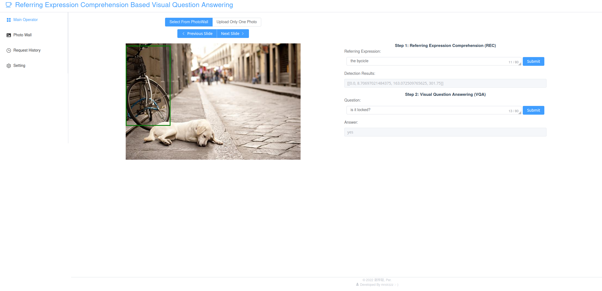

# Referring Expression Based Visual Question Answering

This repository is the official implementation of project "Referring Expression Based Visual Question Answering".



## Installation

We recommand to use docker for installing and deploying this demonstrative vlbert app.

### Frontend

We use `Vue3+ElementPlus+Typescript` for frontend user interface developing, and use [node docker image](https://hub.docker.com/_/node) to build docker image and deploy this vue app.

Here are two ways for getting and deploying frontend docker image used in this repository:

- Run `cd ./vue/app && docker build -t mrxir/rec2vqa:vue .` or just uncomment `build: ./vue/app` line in docker-compose.yml when directly run `docker compose up -d`
- Run `docker pull mrxir/rec2vqa:vue` or just directly run `docker compose up -d`

And, directly run `docker compose up -d` may be the best option.

### Backend

We use `Django+Redis+Rabbitmq` for backend data interface developing, and use [python3 docker image](https://hub.docker.com/_/python) to build this django app environment.

As mentioned in above, you can just directly run `docker compose up -d`, or build or pull it by yourself.

### VLBERT

We use [nvidia-cuda docker image](https://hub.docker.com/r/nvidia/cuda) to build the awful and old environment that vlbert used, which is based on `Ubuntu16.04-Cuda9-Cudnn7-Gcc4.9.3-Pytorch1.1.0-Torchvision0.3.0-Python3.6`

As mentioned in above, you can just directly run `docker compose up -d`, or build or pull it by yourself.

> Note: you must refer to [this wiki](https://github.com/NVIDIA/nvidia-docker/wiki/Advanced-topics#default-runtime) for ensuring you can access nvidia gpus if you want to build vlbert docker image by yourself. Otherwise, you will find that your build image cannot correctly run on the compose stage.

### Miscellaneous

In addition to above docker images, there are also some other miscellaneous files to hold, including `./vlbert/docker_build` for vlbert image build requirements(optional) and `./vlbert/(data|ckpts|model)` including vqa and rec finetuned weights, vlbert cached module weights and datasets for down-stream tasks finetuning(optional). Here is [the baidupan link](null_now_coming_soon). After downloading these files, you need to place these files in corresponding path in order to mount these files into docker container workspace correctly during `docker compose up -d`.

## Deploying

The easiest and best way for deploying this codebase is just running `docke compose up -d` in repository root directory.

And we have five docker images and six services in docker compose deploying.

Docker images:

- `redis:7.0.5-alpine3.16` (public docker repository)
- `rabbitmq:latest` (public docker repository)
- `mrxir/rec2vqa:vue` (build and push by myself at [docker.io/mrxir/rec2vqa:vue](https://hub.docker.com/layers/mrxir/rec2vqa/vue/images/sha256-14d7b5c50991893c232f26fae99b7bfd8e38aa72419a25dfc3687cc3acdb12ff?context=explore))
- `mrxir/rec2vqa:django` (build and push by myself at [docker.io/mrxir/rec2vqa:django](https://hub.docker.com/layers/mrxir/rec2vqa/django/images/sha256-ee19981d87bd4a4cbf0fe9b7bae808a4f1911f88fa202fb0dbe8658d04b4b504?context=explore))
- `mrxir/rec2vqa:vlbert` (build and push by myself at [docker.io/mrxir/rec2vqa:vlbert](https://hub.docker.com/layers/mrxir/rec2vqa/vlbert/images/sha256-c24900fb82fb451b745d2b44bca3122a4995d13a939ceb0cc8b1203a167db039?context=explore))

Docker services:

- `redis` deploy at 5672 open to all local network ips
- `rabbitmq` deploy at 6732 open to all local network ips
- `vue` deploy at 80 open to all local network ips
- `django` deploy at 8080 open to all local network ips
- `vlbert-recworker` deploy after `rabbitmq` booting finished
- `vlbert-vqaworker` deploy after `rabbitmq` booting finished

After deploying, you can visit `http://$YOUR_LOCAL_IP/#/app/Main` for vue frontend interface, and `http://$YOUR_LOCAL_IP:8080` for django backend data api. And if you deploy at a server, then replace `YOUR_LOCAL_IP` with `YOUR_REMOTE_IP`.

Here are my local ip url after deploying this app(You can access it if you are a NPUer):

- [vue local ip url](http://10.31.164.163/#/app/Main)
- [django local ip url](http://10.31.164.163:8080)

## Project Structure

```
.
├── django
│   ├── api (api app root dir)
│   │   ├── admin.py
│   │   ├── apps.py
│   │   ├── constants.py
│   │   ├── consumers.py
│   │   ├── __init__.py
│   │   ├── migrations
│   │   ├── models.py
│   │   ├── routing.py
│   │   ├── sender.py
│   │   ├── serializers.py
│   │   ├── tests.py
│   │   ├── urls.py
│   │   ├── utils.py
│   │   └── views.py
│   ├── backend (project setting dir)
│   │   ├── asgi.py
│   │   ├── __init__.py
│   │   ├── settings.py
│   │   ├── urls.py
│   │   └── wsgi.py
│   ├── db.sqlite3 (sqlite3 database file)
│   ├── Dockerfile
│   ├── manage.py
│   ├── media
│   │   ├── custom
│   │   └── rec
│   ├── recworker.py
│   ├── requirements.txt
│   └── vqaworker.py
├── docker-compose.yml
├── README.md
├── vlbert
│   ├── cfgs (model train/val/test configs)
│   │   ├── pretrain
│   │   ├── refcoco
│   │   ├── vcr
│   │   └── vqa
│   ├── ckpts (finetuned model dir, include vqa and rec)
│   │   ├── ref
│   │   └── vqa
│   ├── common (some common modules required by vlbert including resnet101, fastrcnn)
│   │   ├── backbone
│   │   ├── callbacks
│   │   ├── fast_rcnn.py
│   │   ├── __init__.py
│   │   ├── lib
│   │   ├── lr_scheduler.py
│   │   ├── metrics
│   │   ├── module.py
│   │   ├── nlp
│   │   ├── trainer.py
│   │   ├── utils
│   │   └── visual_linguistic_bert.py
│   ├── data (MS COCO train2014/val2014/test2015 images, vqa/rec annotations and precomputed boxes and features)
│   │   └── coco
│   ├── docker_build
│   │   ├── Miniconda3-py37_4.12.0-Linux-x86_64.sh
│   │   ├── requirements_django.txt
│   │   ├── requirements_vlbert.txt
│   │   ├── tensorflow-2.6.2-cp36-cp36m-manylinux2010_x86_64.whl
│   │   └── torch-1.1.0-cp36-cp36m-linux_x86_64.whl
│   ├── Dockerfile
│   ├── external (pretrained bert codes developed by huggingface)
│   │   └── pytorch_pretrained_bert
│   ├── figs
│   │   ├── attention_viz.png
│   │   └── pretrain.png
│   ├── LICENSE
│   ├── model (pretrained vlbert model, bert model and resnet101 model parameters)
│   │   └── pretrained_model
│   ├── pretrain (some packaged functions)
│   │   ├── data
│   │   ├── function
│   │   ├── _init_paths.py
│   │   ├── modules
│   │   ├── train_end2end.py
│   │   └── vis_attention_maps.py
│   ├── README.md
│   ├── refcoco (vlbert for refcoco codes)
│   │   ├── data
│   │   ├── function
│   │   ├── _init_paths.py
│   │   ├── modules
│   │   ├── test.py
│   │   └── train_end2end.py
│   ├── requirements.txt
│   ├── scripts
│   │   ├── dist_run_multi.sh
│   │   ├── dist_run_single.sh
│   │   ├── dist_run_slurm.sh
│   │   ├── init.sh
│   │   ├── init_slurm.sh
│   │   ├── launch.py
│   │   ├── nondist_run.sh
│   │   ├── nondist_run_slurm.sh
│   │   ├── ref_eval_testA.sh
│   │   ├── ref_eval_testB.sh
│   │   ├── ref_eval_val.sh
│   │   ├── ref_finetune.sh
│   │   ├── vqa_eval.sh
│   │   └── vqa_finetune.sh
│   ├── vcr (vlbert for vcr codes)
│   │   ├── data
│   │   ├── function
│   │   ├── _init_paths.py
│   │   ├── modules
│   │   ├── test.py
│   │   ├── train_end2end.py
│   │   └── val.py
│   ├── viz (vlbert for visulization codes)
│   │   ├── bertviz
│   │   ├── _init_paths.py
│   │   ├── model_view_vl-bert_coco.ipynb
│   │   └── VISUALIZATION.md
│   └── vqa (vlbert for vqa codes)
│       ├── data
│       ├── function
│       ├── _init_paths.py
│       ├── modules
│       ├── test.py
│       └── train_end2end.py
└── vue
    └── app
        ├── babel.config.js
        ├── Dockerfile
        ├── node_modules (installed node_modules)
        ├── package.json
        ├── package-lock.json
        ├── public (static files)
        ├── README.md
        ├── server
        ├── src (vue app root dir)
        ├── tsconfig.json
        └── vue.config.js
```

## References

This repository is developed based mainly on [VLBERT](https://github.com/jackroos/VL-BERT)(for vlbert pytorch model finetuning and inference) and [MAttNet](https://github.com/lichengunc/MAttNet)(for combining redis, rabbitmq and django to asynchronously request model inference).