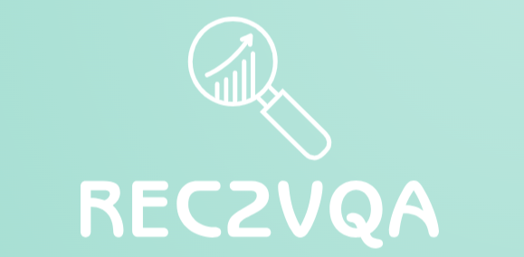
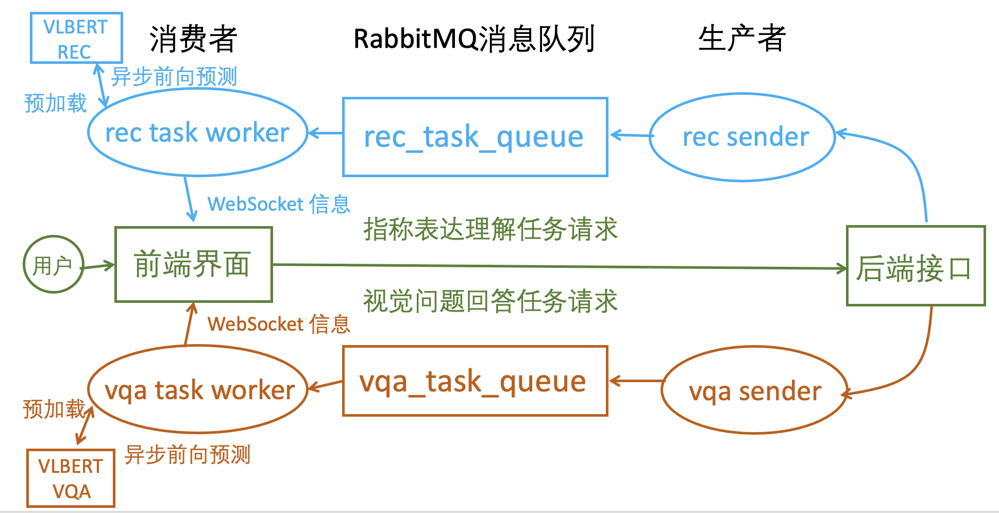

# Referring Expression Based Visual Question Answering

<div align="center">
  
</div>

This project aims at combining the two most prevalent vision-langauge tasks, first referring expression comprenhension(REC) and then visual question answering(VQA), short for REC2VQA. I finetuned VLBERT on VQAv2 and RefCOCO first to get two independent checkpoints, and then developed a demonstration webui to show this new two-stage task based on vue and django. To optimize the large model loading time, I leveraged Redis and RabbitMQ to asynchronously request large model inference after loading the large model in advance.

<div align="center">
  
</div>


## Getting Started

We recommand to use docker for installing and deploying this demonstrative vlbert app.

Before utilizing docker to deploy, we need to mannually set frontend vue node modules and django database migrations:

```shell
cd ./vue/app
npm install # ensure node and npm has been installed

cd ../../django/
pip install -r requirements.txt
python manage.py makemigrations api
python manage.py migrate
```

The reason you need to run above commands is we hope to mount local `./vue/app` and `./django` directory to corresponding container `/work` directroy, so everytime we make changes on the repository codes, the container can has corresponding changes.

### Frontend

We use `Vue3+ElementPlus+Typescript` for frontend user interface developing, and use [node docker image](https://hub.docker.com/_/node) to build docker image and deploy this vue app.

Here are two ways for getting and deploying frontend docker image used in this repository:

- Run `cd ./vue/app && docker build -t mrxir/rec2vqa:vue .` or just uncomment `build: ./vue/app` line in docker-compose.yml when directly run `docker compose up -d`
- Run `docker pull mrxir/rec2vqa:vue` or just directly run `docker compose up -d`

And, directly run `docker compose up -d` may be the best option.

### Backend

We use `Django+Redis+Rabbitmq` for backend data interface developing, and use [python3 docker image](https://hub.docker.com/_/python) to build this django app environment.

As mentioned in above, you can just directly run `docker compose up -d`, or build or pull it by yourself.

### VLBERT

We use [nvidia-cuda docker image](https://hub.docker.com/r/nvidia/cuda) to build the awful and old environment that vlbert used, which is based on `Ubuntu16.04-Cuda9-Cudnn7-Gcc4.9.3-Pytorch1.1.0-Torchvision0.3.0-Python3.6`

As mentioned in above, you can just directly run `docker compose up -d`, or build or pull it by yourself.

> Note: you must refer to [this wiki](https://github.com/NVIDIA/nvidia-docker/wiki/Advanced-topics#default-runtime) for ensuring you can access nvidia gpus if you want to build vlbert docker image by yourself. Otherwise, you will find that your build image cannot correctly run on the compose stage.

### Miscellaneous

In addition to above docker images, there are also some other miscellaneous files to hold, including `./vlbert/docker_build` for vlbert image build requirements(optional) and `./vlbert/(data|ckpts|model)` including vqa and rec finetuned weights, vlbert cached module weights and datasets for down-stream tasks finetuning(optional). Here is [the baidupan link](https://www.alipan.com/s/jNcs6zVEuaq). After downloading these files, you need to place these files in corresponding path in order to mount these files into docker container workspace correctly during `docker compose up -d`.

## Deploying

The easiest and best way for deploying this codebase is just running `docke compose up -d` in repository root directory.

And we have five docker images and six services in docker compose deploying.

Docker images:

- `redis:7.0.5-alpine3.16` (public docker repository)
- `rabbitmq:latest` (public docker repository)
- `mrxir/rec2vqa:vue` (build and push by myself at [docker.io/mrxir/rec2vqa:vue](https://hub.docker.com/layers/mrxir/rec2vqa/vue/images/sha256-14d7b5c50991893c232f26fae99b7bfd8e38aa72419a25dfc3687cc3acdb12ff?context=explore))
- `mrxir/rec2vqa:django` (build and push by myself at [docker.io/mrxir/rec2vqa:django](https://hub.docker.com/layers/mrxir/rec2vqa/django/images/sha256-ee19981d87bd4a4cbf0fe9b7bae808a4f1911f88fa202fb0dbe8658d04b4b504?context=explore))
- `mrxir/rec2vqa:vlbert` (build and push by myself at [docker.io/mrxir/rec2vqa:vlbert](https://hub.docker.com/layers/mrxir/rec2vqa/vlbert/images/sha256-c24900fb82fb451b745d2b44bca3122a4995d13a939ceb0cc8b1203a167db039?context=explore))

Docker services:

- `redis` deploy at 5672 open to all local network ips
- `rabbitmq` deploy at 6732 open to all local network ips
- `vue` deploy at 80 open to all local network ips
- `django` deploy at 8080 open to all local network ips
- `vlbert-recworker` deploy after `rabbitmq` booting finished
- `vlbert-vqaworker` deploy after `rabbitmq` booting finished

After deploying, you can visit `http://$YOUR_LOCAL_IP/#/app/Main` for vue frontend interface, and `http://$YOUR_LOCAL_IP:8080` for django backend data api. And if you deploy at a server, then replace `YOUR_LOCAL_IP` with `YOUR_REMOTE_IP`.

I deploy on my local network server, and here are urls after deploying this app and NAT traversa by `Cloudflare Zero-Trust Tunnel`:

- [vue frontend url](https://rec2vqafr.mrxir.cloud/#/app/Main)
- [django backend url](https://rec2vqabk.mrxir.cloud/)

## Demo Video

https://github.com/XIRZC/rec2vqa/assets/48874620/dc4d8bfc-ecae-4625-975e-84723b562aab

## Project Structure

```
.
├── assets # static resources
│   ├── data_flow.png
│   ├── demo.mp4
│   ├── logo.png
│   ├── presentation.pptx
│   ├── sys_arch.png
│   └── thesis.pdf
├── django # backend django api
│   ├── api # main django app
│   ├── backend # django configurations
│   ├── db # sqlite database
│   ├── Dockerfile # django docker build file
│   ├── manage.py # django main program
│   ├── media # django host static files path
│   ├── recworker.py # referring expression comprehension asynchronous worker
│   ├── requirements.txt # python dependencies
│   └── vqaworker.py # visual question answering asynchronous worker
├── docker-compose.yml # docker compose configuration file
├── README.md
├── vlbert # vision-language large model for VQA and REC
│   ├── cfgs
│   ├── ckpts
│   ├── common
│   ├── data
│   ├── Dockerfile
│   ├── external
│   ├── figs
│   ├── LICENSE
│   ├── model
│   ├── pretrain
│   ├── README.md
│   ├── refcoco
│   ├── requirements.txt
│   ├── scripts
│   ├── vcr
│   ├── viz
│   └── vqa
└── vue # frontend vue app
    └── app

21 directories, 17 files
```

## References

This repository is developed based mainly on [VLBERT](https://github.com/jackroos/VL-BERT)(for vlbert pytorch model finetuning and inference) and [GradCam Demo](https://github.com/Cloud-CV/Grad-CAM) & [MAttNet Demo](https://github.com/lichengunc/MAttNetDemo)(for combining redis, rabbitmq and django to asynchronously request model inference and realtime communication using websockets).
